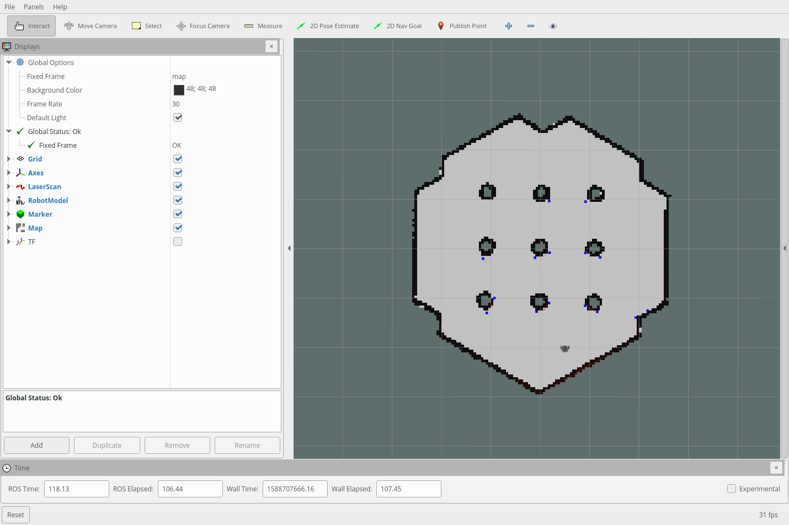

# TangentPlanner

**ROS plugin for the base local planner which uses the tangent bug algorithm**

This plugin adheres to the BaseLocalPlanner interface in the nav_core package.

## Installation
Change directory to your ROS workspace and then type the following:

```bash
cd src
git clone https://github.com/ibrahimjad/tangent_planner.git
cd -

catkin build tangent_planner
source ~/.bashrc
```

In the move_base launch file, change the value of **base_local_planner** parameter to **tangent_planner/TangentPlanner**

Load the parameters in the [param/tangent_planner_params.yaml](param/tangent_planner_params.yaml).

## Tangent Bug Algorithm
[Explaination of how the algorithm work can be found here](http://www.cs.bilkent.edu.tr/~culha/cs548/hw1/)

